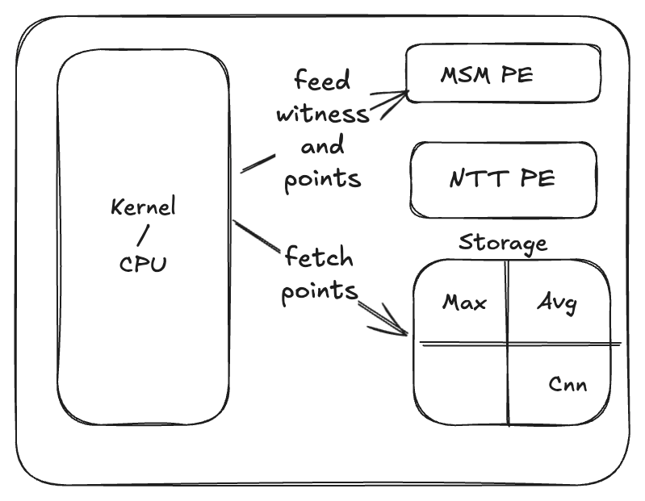
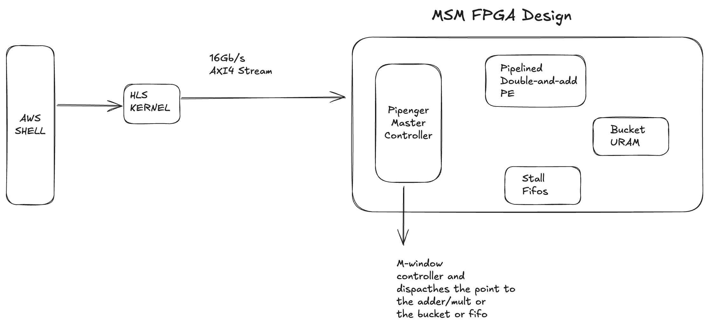

# ZKML Fpga

The aim of the project is to implement a zkml framework on the fpga board and outperform the existing zkml frameworks running on cpu

# Accelerator Design

To make the accelerator specially zkml we add a fixed number of points which are sort of compiled r1cs this might change to polynomial coffiecients in actual implmentations due to security reasons but if I can have a strong argument for hardcoded bases for msm it will be awesome
with bases of the msm computations known before we can just fetch them as needed we remove the need for ntt operation saving us more time than other zk accelerator and targetting zkml

## PE

### msm

We need to process ~2.5 Billion msm operation thus this is the core bottlneck that needs to fixed
The current code implements a simple msm c but will move onto this design eventually

# Benchmarks

## Emprical Runs

All the following schemes were benchmarked on Intel(R) Core(TM) i7-8700K CPU @ 3.70GHz. These were all tested on a standard configuration with no specialized hardware acceleration.

Here's a clean table format for:

| Scheme           | Model        | Prover Time (s)  | Verifier Time (s)  |   Proof Size         |
|------------------|--------------|------------------|--------------------|----------------------|
| vCNN(groth16)    | vgg11        | 132.2            | 0.043              |         127b         |
| zkCNN            | Vgg11        | 20.4             | 2                  |      109.906250 kb   |
| MSCProof         | vgg11        | 2.9              | 5                  |        43kb          |
| EZKL             | lenet5       | 20.5             | 0.04               |         32b          |

**NOTE**: zkCNN implementation is not zero knowledge hence the prover times are really not reflective with others

## Asymptotic Complexity

| Scheme           | Prover Complexity | Verifier Complexity |  Communication Complexity |
|------------------|-------------------|----------------------|--------------------------|
| vCNN             | O(n log n)        | O(log n)             |     O(1)                 |
| zkCNN            | O(n^2)            | O(1)                 |     O(n^2)               |
| MSCProof         | O(n log^2 n)      | O(log n)             |     O(nlogn)             |
| EZKL             | ---               | O(log n)             |    O(1)                  |

# Road Map

The current plan is to implement the primitives of bn254 curve for a polynomial commitment scheme (PCS) and build up to a complete ZKML framework with two main plan of actions

## Implementation Approaches

### Baked R1CS

**PROS**:

- Will significantly improve current framework
- Smaller proof size

**CONS**:

- Not flexible for all models
- CNNs are particularly challenging

### General Sumcheck Prover

**PROS**:

- Faster prover times
- Can handle more complex computations

**CONS**:

- Very large prover size
- High bandwidth requirements

## Road map and todo

- [x] Benchmark existing schemes
- [x] Implement finite field (FF) operations with faster Montgomery reduction
- [x] Implement elliptic curve cryptography (ECC) and multi-scalar multiplication with Pippenger's algorithm
- [x] Implement fast Number Theoretic Transform (NTT) for polynomial operations

## FPGA Implementation Goals

The FPGA implementation aims to achieve:
